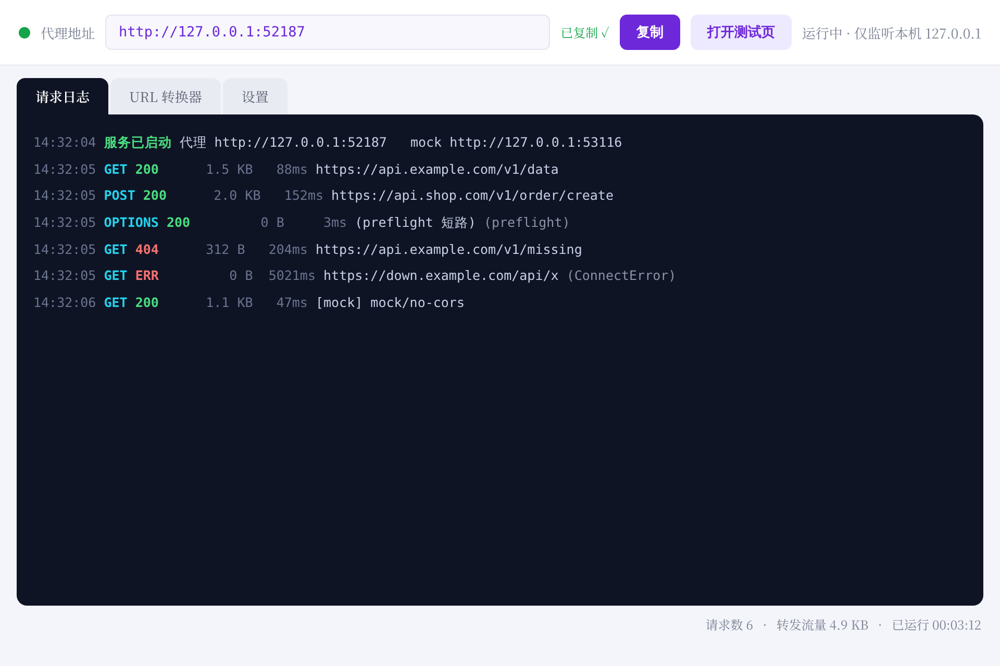

# CORS 本地代理（Local cors.sh）

把开源项目 [cors.sh](https://github.com/gridaco/cors.sh) 的核心能力搬到本地：一个**双击即用、零配置、免安装**的本地 CORS 代理工具。双击 EXE 后自动启动代理服务和浏览器测试页，任何被 CORS 拦截的接口，在前面拼上本机代理地址即可正常请求。



---

## 一、如何得到 EXE（三步，约 5 分钟）

> 说明：PyInstaller 不支持跨平台打包，EXE 需要在 Windows 电脑上生成一次。生成后即可拷贝给其他 Windows 电脑双击运行，**无需再装 Python**。

### 第 1 步：安装 Python

1. 打开 <https://www.python.org/downloads/>，下载 Python 3.9 ~ 3.13 任一版本。
2. 安装时**务必勾选** `Add python.exe to PATH`。
3. 验证：按 `Win + R` 输入 `cmd` 回车，在黑窗口输入 `python --version`，能显示版本号即可。

> ⚠️ 不要用 Microsoft Store 版 Python（打包常有兼容问题），请用 python.org 的安装包。

### 第 2 步：双击 `build_exe.bat`

1. 把整个 `cors-local-proxy` 文件夹放到电脑上任意位置（路径建议不含特殊字符）。
2. 双击 `build_exe.bat`，等待 1~3 分钟。脚本会自动：安装依赖 → 调用 PyInstaller 打包 → 完成后打开输出目录。
3. 产物：`dist\CORS-Local-Proxy.exe`（约 15~20 MB，单文件，带本 README 同款紫色图标）。

### 第 3 步：双击 EXE 使用

双击后窗口弹出、服务自动启动、浏览器自动打开测试页。把窗口顶部的代理地址复制走即可干活。

---

## 二、怎么用

### 规则：只有一条

在任意被 CORS 拦截的 URL 前面，拼上代理地址 + `/`：

```text
原始：  https://api.example.com/data
代理：  http://127.0.0.1:52187/https://api.example.com/data
        └── 本机代理地址 ──┘└────── 原始 URL 不变 ──────┘
```

前端代码示例：

```js
// 原来这样会被浏览器拦：
fetch("https://api.example.com/data")

// 拼上代理地址就行：
fetch("http://127.0.0.1:52187/https://api.example.com/data")
  .then(r => r.json())
  .then(console.log);
```

> 端口是启动时自动挑选的空闲端口，以窗口顶部显示为准（可在「设置」页固定）。

### 界面三个选项卡

| 选项卡 | 功能 |
|---|---|
| **请求日志** | 实时滚动显示每个经过代理/mock 的请求：方法、状态码、流量、耗时、目标 URL，按状态着色（绿=2xx，黄=3xx，红=4xx/5xx/失败）。 |
| **URL 转换器** | 粘贴原始 URL，自动生成代理 URL，一键复制 / 浏览器打开 / 跳转测试页调试。 |
| **设置** | 固定端口（默认自动挑选）、关闭"启动自动打开浏览器"。 |

### 内置测试页（`http://127.0.0.1:端口/`）

对标 cors.sh 官方 playground：输入目标 URL，**左边"直连"、右边"走代理"同屏对比**，直观看到直连被 CORS 拦、代理放行。还内置了一组本地 mock 端点（无需联网也能演示）：

| Mock 端点 | 行为 | 用途 |
|---|---|---|
| `/mock` 地址 `/no-cors` | 不带任何 CORS 头 | 演示"必被拦截" |
| `/allow-all` | `Access-Control-Allow-Origin: *` | 演示"直连可通" |
| `/wrong-origin` | ACAO 指向别的域 | 演示"ACAO 不匹配也被拦" |
| `/echo` | 回显 method / headers / body | 调试请求头与请求体 |

---

## 三、代理做了什么（技术细节）

**转发时剥离**（匿名化，保护隐私、避免上游风控误判）：

- hop-by-hop 头（`connection`、`transfer-encoding` 等）
- `Cookie` / `Origin` / `Referer`
- 浏览器上下文头（`Sec-Fetch-*`、`Sec-CH-UA-*`）

**响应时改写**：

- 统一覆盖为 `Access-Control-Allow-Origin: *`（因此**不支持**带 cookie 凭证的跨域请求，与 cors.sh 相同）
- `OPTIONS` 预检一律短路返回 200，按请求反射放行的方法与头
- 剥离上游 `Set-Cookie`；`Expose-Headers` 暴露全部响应头名
- 上游 gzip/deflate 自动解压后流式回写，避免解压长度错乱
- 附带**调试头**（借鉴 cors-anywhere）：`X-Request-URL` 记录初始 URL，`X-CORS-Redirect-n` 记录重定向每一跳，`X-Final-URL` 记录最终落点（跟随重定向后实际到达的地址），在 DevTools 和内置测试页中均可见

**安全边界**：服务只监听 `127.0.0.1`，局域网内其他设备无法访问；并发模型为线程池式 ThreadingHTTPServer + requests 连接池。

---

## 四、常见问题（FAQ）

**1. 双击 EXE 弹出蓝色警告"Windows 已保护你的电脑"（SmartScreen）？**
点「更多信息」→「仍要运行」。这是未签名 EXE 的正常提示，本工具源码就在你手里，可自行审阅。

**2. 双击 EXE 后窗口一闪而过？**
先确认是用 `build_exe.bat` 打包的产物；若在开发模式直接 `python main.py` 报错，检查是否安装了 `requests`（`pip install -r requirements.txt`）。

**3. 提示端口被占用 / 想固定端口？**
「设置」页选「固定端口」输入 1024~65535 之间的值，点「应用并重启服务」。

**4. 双击 build_exe.bat 提示找不到 Python？**
Python 未加入 PATH。重新运行 python.org 安装包，勾选 `Add python.exe to PATH`，或手动勾选后重装。

**5. onefile 版双击后要等 2~4 秒才出窗口？**
单文件 EXE 启动需先解压到临时目录，属正常现象。想要秒开可以自行改用目录模式打包：

```bat
python -m PyInstaller --noconfirm --clean --onedir --windowed --icon "icon.ico" --add-data "icon.ico;." --name "CORS-Local-Proxy" main.py
```

（产物在 `dist\CORS-Local-Proxy\` 文件夹里，主程序同样双击运行。）

**6. Mac / Linux 能用吗？**
源码本身跨平台，`python main.py` 即可运行（GUI 字体会自动回退）；但 EXE 打包只在对应平台进行，如需 macOS 版要在 Mac 上用 PyInstaller 打包。

**7. 为什么代理后某些网站仍返回 403 / 验证码？**
目标网站风控识别出代理特征或数据中心 IP，属于目标网站的限制，任何 CORS 代理都绕不过。

---

## 五、文件结构

```text
cors-local-proxy/
├── main.py            GUI 入口（tkinter：日志 / URL转换器 / 设置）
├── server.py          代理核心（ProxyServer 数据面 + MockServer 测试端点）
├── test_page.py       内置浏览器测试页（HTML 模板）
├── icon.ico           应用图标（EXE 图标 + 窗口图标 + favicon）
├── icon_256.png       图标预览图
├── ui_preview.png     界面预览图（README 引用）
├── build_exe.bat      Windows 一键打包脚本
├── requirements.txt   依赖清单（requests + pyinstaller）
└── README.md          本文件
```

开发模式直接运行：`pip install -r requirements.txt` 后 `python main.py`。

---

## 六、声明

- 本工具是 [gridaco/cors.sh](https://github.com/gridaco/cors.sh) 思想的本地化实现，仅供**开发与调试**使用。
- 通过代理访问第三方服务时，请遵守目标网站的服务条款与当地法律法规；请勿用于生产环境——给"自己的服务器"解决跨域，正确做法是在服务端直接返回 CORS 头。
- 代码 MIT 协议，可自由修改与分发。
